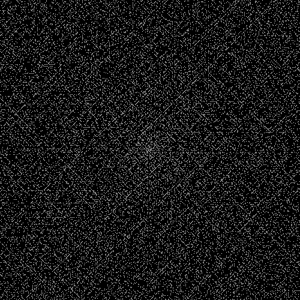

# Ulam Spiral 
Ulam Spiral or also called the Prime Spiral is a graphical visuals devised by the mathematician Stanislaw Ulam, the general idea of Ulam Spiral is creating a sequence of numbers starting from the center with 1, and create a spiral movement from there, then it detects the prime number of the sequence. This visual is amazing as it shows how there is actually a pattern of prime numbers if we look it this way, even though there is no valid proof saying that there is a deiscernable pattern in the occurence of the primes.

  

